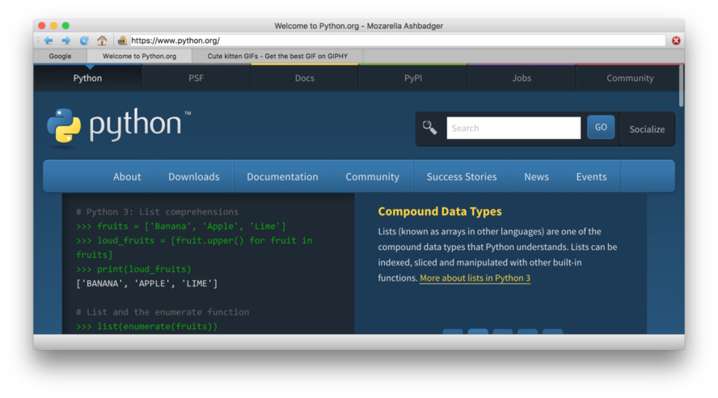

# Web Browser

## Mooseache — How web browsers would be if they'd just been invented

This is an example web browser built with Python and Qt. Using the 
QtWebEngineWidgets system introduced in Qt5.6, this provides a single-window
browsing experience with the usual controls, as well as saving and loading HTML.

## Mozzarella Ashbadger — Upgrade your browsing with tabs
Mozarella Ashbadger is the latest revolution in web 
browsing! Go back and forward! Print! Save files! Get help! 
(you’ll need it). Any similarity to other browsers is entirely 
coincidental.

### Code notes

#### Tabbing

Adding tab support complicates the internals of the browser a bit, since we
now need to keep track of the currently active browser view, both to update
UI elements (URL bar, HTTPs icon) to changing state in the currently active
window, and to ensure the UI events are dispatched to the correct web view.

This is achieved by using intermediate slots which filter events, and by
adding signal redirection (using lamba functions to keep it short).

> If you think these apps are neat and want to learn more about
PySide2 in general, take a look at my [free PyQt tutorials](https://www.learnpyqt.com)
which cover everything you need to know to start building your own applications with PyQt.

### Other licenses

Icons used in the application are by [Yusuke Kamiyaman](http://p.yusukekamiyamane.com/).
